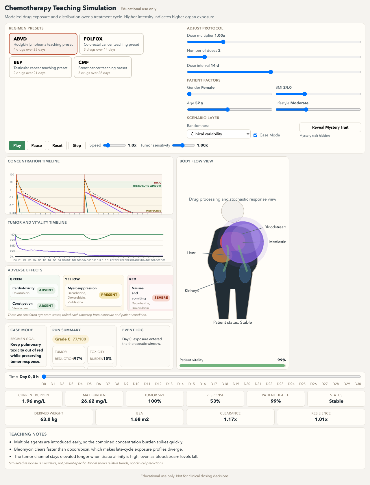

# human-chemo-drug-simulation

A browser-based teaching demo that visualizes chemotherapy drug concentration and tumor response
in a simplified human body over a 30-day window, for students and instructors exploring
pharmacokinetics through named regimen presets and manual dosing.

Test it out live: [vosslab.github.io/human-chemo-drug-simulation](https://vosslab.github.io/human-chemo-drug-simulation/)

<!-- screenshots:begin (managed by screenshot-docs) -->

<!-- screenshots:end -->

## Documentation

- [docs/INSTALL.md](docs/INSTALL.md): Setup steps and dependencies.
- [docs/USAGE.md](docs/USAGE.md): Build, serve, and test commands for the web app.
- [docs/CODE_ARCHITECTURE.md](docs/CODE_ARCHITECTURE.md): High-level system design and data flow.
- [docs/FILE_STRUCTURE.md](docs/FILE_STRUCTURE.md): Directory map of the repo.
- [docs/TROUBLESHOOTING.md](docs/TROUBLESHOOTING.md): Known issues and debugging steps.
- [docs/CHANGELOG.md](docs/CHANGELOG.md): History of changes.
- [docs/REPO_STYLE.md](docs/REPO_STYLE.md): Repository structure, naming, and versioning conventions.
- [docs/TYPESCRIPT_STYLE.md](docs/TYPESCRIPT_STYLE.md): TypeScript formatting and project conventions.
- [docs/MARKDOWN_STYLE.md](docs/MARKDOWN_STYLE.md): Markdown writing and formatting conventions.

## Quick start

Build the TypeScript app into the GitHub Pages artifact:

```bash
./build_github_pages.sh
```

The build compiles `src/*.ts` and emits `dist/index.html` and `dist/main.js`.
The `dist/` directory is the GitHub Pages artifact and is not tracked in git.

To preview the app locally, run the dev server, which builds and then serves
`dist/` on a random port and opens a browser:

```bash
./run_web_server.sh
```

## Testing

Run the fast gate (typecheck, lint, format check, and Node module tests):

```bash
./check_codebase.sh
```

Run the pytest suite:

```bash
pytest tests/
```

Run the Playwright browser smoke test:

```bash
./run_playwright_tests.sh
```
